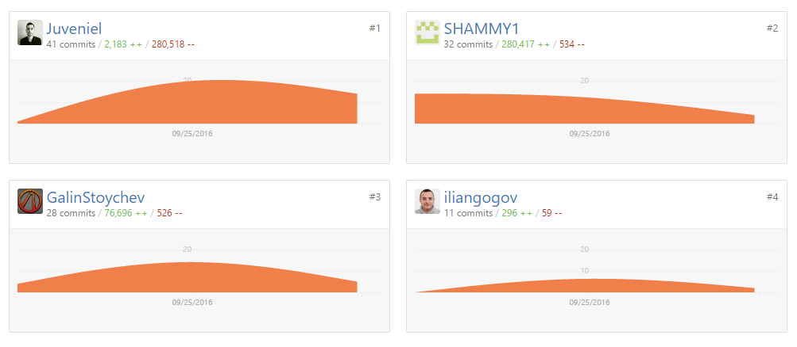

<!-- section start -->
<!-- attr: { class:'slide-title', showInPresentation:true, hasScriptWrapper:true } -->
# Team "Namor"

<!--  -->

	
JavaScript Applications TeamWork

	
Telerik Academy by Progress

	<a href="http://github.com/Team-Namor/Book-Store" class="signature-link">Link to the GitHub repository</a>

<!-- section start -->
<!-- attr: { showInPresentation:true, style:'font-size: 0.7em' } -->

# Team Namor Members

| Name | Academy | GitHub |
| :------------- | :------------------- | :--------------------------------------------|
| Галин Стойчев  | [Galin_Stoychev](http://telerikacademy.com/Users/Galin_Stoychev)  | [GalinStoychev](http://github.com/GalinStoychev)  |
| Димитър Калайджиев | [Juveniel](http://telerikacademy.com/Users/Juveniel)| [Juveniel](http://github.com/Juveniel)|
| Хишам Ибрахим   | [SHAMMY](http://telerikacademy.com/Users/SHAMMY)          | [SHAMMY1](http://github.com/SHAMMY1)|
| Илиян Гогов  | [iliangogov](http://telerikacademy.com/Users/iliangogov)    | [iliangogov](http://github.com/iliangogov)|
| Борислав Попниколов | [bpopnikolov ](http://telerikacademy.com/Users/kissaev)   | [bpopnikolov](https://github.com/bpopnikolov) |
 

<!-- section start -->
<!-- attr: { class:'slide-title', showInPresentation:true, hasScriptWrapper:true } -->

# GitHub graphics

<!--  -->

<!--  -->

<!-- section start -->
<!-- attr: { showInPresentation:true, style:'font-size: 0.7em' } -->

# Another Slide
   

 
 <!-- section start -->
<!-- attr: { showInPresentation:true, style:'font-size: 0.7em', hasScriptWrapper:true } -->

# Another Slide

<!--  -->

<!--  -->

<!-- section start -->
<!-- attr: { showInPresentation:true, style:'font-size: 0.7em' } -->

# Another Slide

<!-- section start -->
<!-- attr: { showInPresentation:true, style:'font-size: 0.7em', hasScriptWrapper:true } -->

# Another Slide

<!--  -->

<!--  -->

